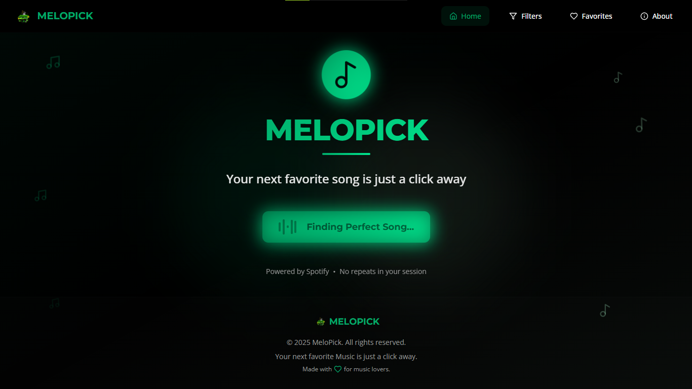

# 🎵 MeloPick





<div align="center">

[](https://melopick.netlify.app/)


</div>
MeloPick is a sleek, green-and-black themed web app that helps you discover random songs using the Spotify API.  
Say goodbye to endlessly scrolling through playlists — MeloPick finds hidden gems and lets you groove instantly.

---

## 🌟 Features

- 🎶 **Random Song Discovery** – Get a fresh track every time you click.
- 🎨 **Stylish UI** – Green & black theme with a modern, music-inspired design.
- 📱 **Responsive** – Works smoothly on desktop, tablet, and mobile.
- 🔍 **Song Details** – View track name, artist, album art, and a play preview.
- ❤️ **Favorites** – Save your favorite songs to revisit later.
- 🔗 **Direct Links** – Open songs directly on Spotify.

---

## 🛠 Tech Stack

- **Frontend:** HTML, CSS, JavaScript (React or Vanilla)
- **API:** [Spotify Web API](https://developer.spotify.com/documentation/web-api/)
- **Hosting:** Netlify / Vercel
- **Fonts:** [Audiowide](https://fonts.google.com/specimen/Audiowide) for logo, [Poppins](https://fonts.google.com/specimen/Poppins) for UI.

---

## 🔑 Setup Instructions

1. **Clone the repository**
   ```bash
   git clone https://github.com/yourusername/melopick.git
   cd melopick
   ```

2. **Install dependencies** (if using React)

   ```bash
   npm install
   ```

3. **Get Spotify API Credentials**

   * Go to the [Spotify Developer Dashboard](https://developer.spotify.com/dashboard/)
   * Create an app and copy your:

     * `Client ID` → `cf9--------------cc16`
     * `Client Secret` → `8f9---------------740`

4. **Create `.env` file**

   ```env
   REACT_APP_SPOTIFY_CLIENT_ID=
   REACT_APP_SPOTIFY_CLIENT_SECRET=
   ```

5. **Run the app locally**

   ```bash
   npm start
   ```

---

## 🚀 Deployment

Deploy to [Netlify](https://www.netlify.com/).

---

## 📜 License

This project is licensed under the MIT License.

---

## 💡 Acknowledgments

* **Spotify Web API** for song data and previews.
* **Google Fonts** for typography.
* **Brand Family** – MeloPick is part of the “Pick” brand alongside CinePick and AniePick.


